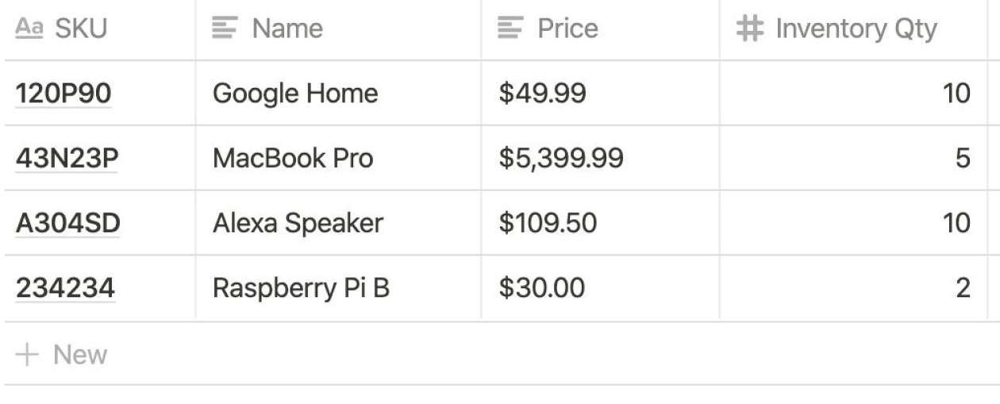

# BE - Shopping API

## Introduction
Have you shopped online? Let’s imagine that you need to build the checkout backend service that will support different promotions with the given inventory. Build a checkout system with these items:

## Requirements

The system should have the following promotions:
- Each sale of a MacBook Pro comes with a free Raspberry Pi B
- Buy 3 Google Homes for the price of 2
- Buying more than 3 Alexa Speakers will have a 10% discount on all Alexa speakers

## Examples
Scanned Items: MacBook Pro, Raspberry Pi B
Total: $5,399.99
Scanned Items: Google Home, Google Home, Google Home
Total: $99.98
Scanned Items: Alexa Speaker, Alexa Speaker, Alexa Speaker
Total: $295.65

## Intructions
Please write it in Golang or Node with a CI script that runs tests and produces a binary.
Finally, imagine that adding items to cart and checking out was a backend API. Please design a schema file for GraphQL on how you would do this.
Thank you for your time and we look forward to reviewing your solution. If you have any questions, please feel free to contact us. Please send us a link to your git repo.
